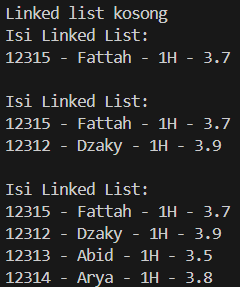
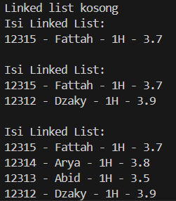
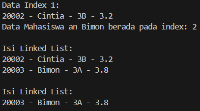
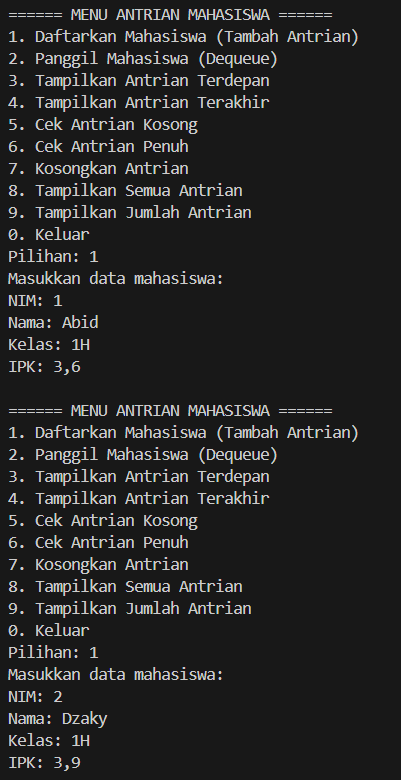
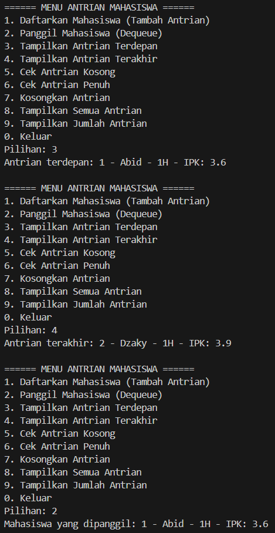
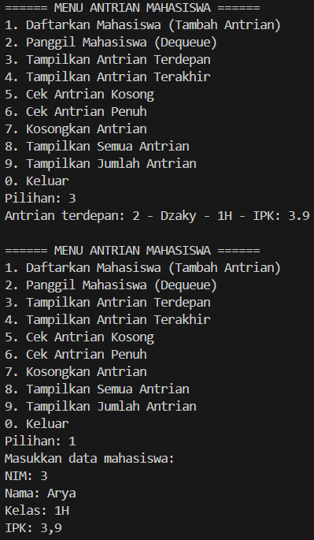
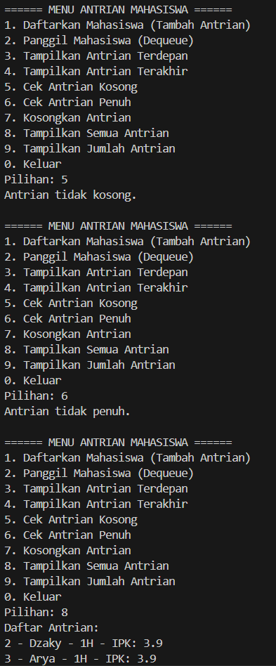
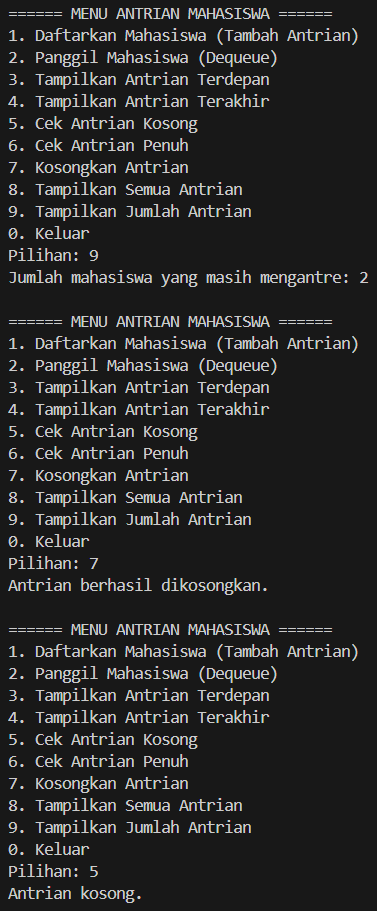

|  | Algorithm and Data Structure |
| ------------- |-------------|
| NIM | 244107020107     |
| Nama | Helmi Rizqi Ramadhan     |
| Kelas | TI-1H     |
| Reposity | [GitHub GH-Rumi](https://github.com/GH-Rumi/algorithm-jobsheet) |

# KONSEP DASAR PEMROGRAMAN

## 2.1 Percobaan 1

Hasil Kode Program:




## Pertanyaan 2.1

1. Karena belum ada data dalam linked list sehingga menampilkan sesuai yang diperintahkan
2. Sebagai penyimpanan sementara untuk sehingga isi dalam data tidak berubah
3. Berikut adalah kode yang saya ubah
    ```
        public static void main(String[] args) {
        Scanner ena = new Scanner(System.in);
        SingleLinkedList11 sll = new SingleLinkedList11();

        while (true) {
            System.out.println("\n=== MENU ===");
            System.out.println("1. Tambah Mahasiswa di Awal");
            System.out.println("2. Tambah Mahasiswa di Akhir");
            System.out.println("3. Tambah Mahasiswa setelah nama tertentu");
            System.out.println("4. Tambah Mahasiswa di posisi tertentu");
            System.out.println("5. Tampilkan Data");
            System.out.println("0. Keluar");
            System.out.print("Pilih menu: ");
            int menu = ena.nextInt();
            ena.nextLine();

            if (menu == 0) {
                System.out.println("Keluar dari program.");
                break;
            }

            Mahasiswa11 mhs = null;
            if (menu >= 1 && menu <= 4) {
                System.out.print("NIM: ");
                String nim = ena.nextLine();
                System.out.print("Nama: ");
                String nama = ena.nextLine();
                System.out.print("Kelas: ");
                String kelas = ena.nextLine();
                System.out.print("IPK: ");
                double ipk = ena.nextDouble();
                ena.nextLine();

                mhs = new Mahasiswa11(nim, nama, kelas, ipk);
            }

            switch (menu) {
                case 1:
                    sll.addFirst(mhs);
                    break;
                case 2:
                    sll.addLast(mhs);
                    break;
                case 3:
                    System.out.print("Masukkan nama mahasiswa sebelum ini (target insertAfter): ");
                    String targetNama = ena.nextLine();
                    sll.insertAfter(mhs, targetNama);
                    break;
                case 4:
                    System.out.print("Masukkan indeks (mulai dari 0): ");
                    int index = ena.nextInt();
                    ena.nextLine();
                    sll.insertAt(index, mhs);
                    break;
                case 5:
                    sll.print();
                    break;
                default:
                    System.out.println("Pilihan tidak valid.");
            }
        }

        ena.close();
    }
    ```
## Percobaan 2.2

Hasil Kode Program:



## Pertanyaan 2.2

1. `break` digunakan untuk menghentikan perulangan setelah data ditemukan dan dihapus, agar tidak memeriksa node selanjutnya yang tidak perlu.
2. Kode tersebut mengecek jika node yang dihapus adalah tail. Jika benar, tail dipindah ke node sebelumnya agar penanda akhir list tetap akurat.

## Tugas

Hasil Kode Program:









