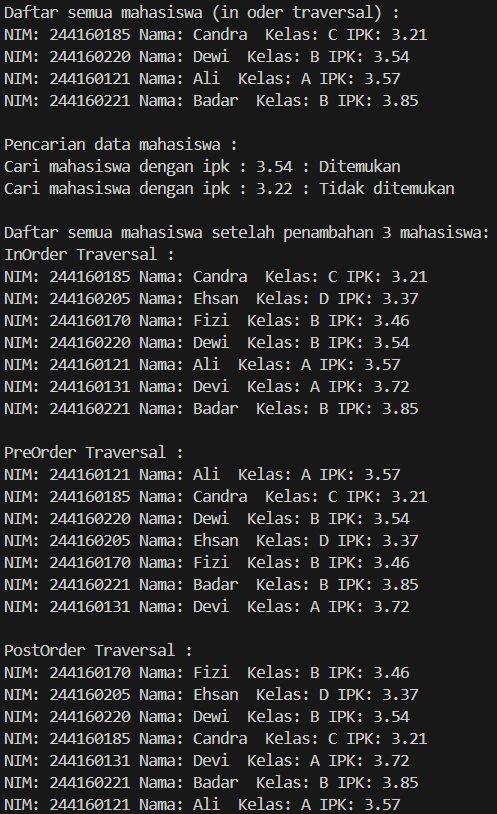
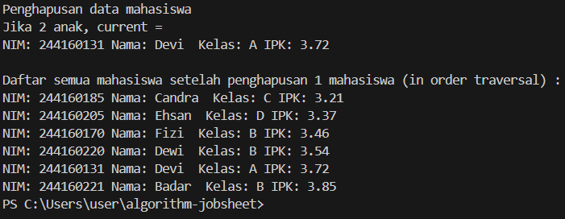
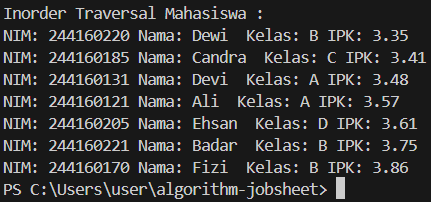

|            | Algorithm and Data Structure |
| ---------- | ---------------------------- |
| NIM        | 244107020107                 |
| Nama       | Helmi Rizqi Ramadhan         |
| Kelas      | TI - 1H                      |
| Repository | [Github](https://github.com/GH-Rumi/algorithm-jobsheet) |

# Tree

### 2.1 Verifikasi Hasil

Hasil Kode Program :





### 14.2.2 Pertanyaan Percobaan

1. Karena BST terurut, pencarian bisa dilakukan secara logaritmik (O(log n)) dibandingkan pencarian linear (O(n)) pada binary tree biasa yang tidak terurut.

2. left: Menunjuk ke anak kiri yang nilainya lebih kecil dari node induk.

right: Menunjuk ke anak kanan yang nilainya lebih besar dari node induk.

3. root adalah titik awal semua operasi pohon seperti tambah, cari, hapus, dan traversal.

   Saat objek tree dibuat pertama kali, root bernilai null karena pohon masih kosong

4. Cek apakah root bernilai null (tree kosong).

   Jika ya, node baru langsung menjadi root.

5. Perhatikan method add(), di dalamnya terdapat baris program seperti di bawah ini. Jelaskan secara detil untuk apa baris program tersebut?
```
parent = current
if (mahasiswa.ipk < current.mahasiswa.ipk) {
    current = current.left;
    if (current == null) {
        parent.left = newNOde;
        return;
    }
} else {
    current = current.right;
    if (current == null) {
        parent.right = newNode;
        return;
    }
}
```

Variabel parent menyimpan referensi ke node induk saat pencarian posisi penyisipan berlangsung. Ini penting agar node baru dapat dihubungkan sebagai anak kiri atau kanan dari node induk yang sesuai.

6. Langkah-langkah delete():

Cari inorder successor (node terkecil di subtree kanan) dengan getSuccessor().

Gantikan node yang dihapus dengan successor, lalu sesuaikan link left dan right agar struktur BST tetap valid.

Peran getSuccessor():

Menemukan node pengganti terbaik dengan mencari node paling kiri dari subtree kanan.

Menjaga sifat BST agar tetap terurut.

Menyesuaikan tautan successor jika memiliki anak kanan.

## 14.3 Implementasi Binary Tree dengan Array

### 14.3.1 Verifikasi Hasil



### 14.3.2 Pertanyaan Percobaan

Tentu! Berikut ini adalah versi ringkas dari penjelasan kamu, disusun dalam format Markdown:

---

1. Kegunaan Atribut `dataMahasiswa` dan `idxLast` di Class `BinaryTreeArray`

* **`dataMahasiswa`**
  Array bertipe `Mahasiswa08[]` yang menyimpan data node pohon. Posisi indeks menunjukkan struktur pohon (parent-child).

* **`idxLast`**
  Menyimpan indeks terakhir yang berisi data valid. Digunakan untuk:

  * Menentukan batas saat traversal.
  * Mengetahui posisi penambahan node baru.
  * Menghindari akses indeks di luar data.

---

2. Kegunaan Method `populateData()`

* Mengisi array pohon dengan data `Mahasiswa08[]` sekaligus.
* Mengatur `idxLast` agar mencerminkan jumlah data yang valid dalam array.
* Mempermudah inisialisasi tanpa penambahan satu per satu.

---

3. Kegunaan Method `traverseInOrder()`

* Melakukan penelusuran inorder pada pohon biner yang disimpan sebagai array.
* Menggunakan posisi indeks untuk menentukan struktur pohon.
* Hanya menelusuri data sampai `idxLast` untuk memastikan traversal yang valid.

---

4. Posisi Anak Kiri dan Kanan dalam Array

Jika node berada di indeks `i`, maka:

* **Left Child**  = `2 * i + 1`
* **Right Child** = `2 * i + 2`

Contoh:
Jika node berada di indeks `2`, maka:

* Left child = `2 × 2 + 1 = 5`
* Right child = `2 × 2 + 2 = 6`

---

5. Kegunaan `int idxLast = 6;` dalam Kode

```java
Mahasiswa08[] dataMahasiswa = {mhs1, mhs2, mhs3, mhs4, mhs5, mhs6, mhs7, null, null, null};
int idxLast = 6;
bta.populateData(dataMahasiswa, idxLast);
```

* `idxLast = 6` berarti hanya elemen indeks 0 sampai 6 yang terisi.
* Membatasi traversal dan operasi hanya pada elemen valid.
* Menghindari pengolahan `null` pada indeks yang belum terisi.

---

6. Alasan Penggunaan `2 * idxStart + 1` dan `2 * idxStart + 2` dalam Rekursi

* Rumus ini digunakan untuk **mendapatkan indeks anak kiri dan kanan** dari node pada indeks `idxStart`.
* Merupakan **konvensi standar** dalam representasi pohon biner di array.
* Memungkinkan traversal seperti inorder tanpa pointer, hanya menggunakan perhitungan indeks.

Contoh:

```java
traverseInOrder(2 * idxStart + 1); // anak kiri
System.out.println(dataMahasiswa[idxStart]);
traverseInOrder(2 * idxStart + 2); // anak kanan
```

---

Kalau kamu ingin saya ubah ini jadi dokumen `.md` atau konversi ke PDF, tinggal bilang saja!

## 14.4 Tugas Praktikum

1. Buat method di dalam class `BinaryTree00` yang akan menambahkan node dengan cara rekursif (`addRekursif()`).
```
// 1. Method addRekursif()
public void addRekursif(Mahasiswa08 mahasiswa) {
    root = addRekursif(root, mahasiswa);
}

Node08 addRekursif(Node08 current, Mahasiswa08 mahasiswa) {
    if (current == null) {
        return new Node08(mahasiswa);
    }

    if (mahasiswa.ipk < current.mahasiswa.ipk) {
        current.left = addRekursif(current.left, mahasiswa);
    } else if (mahasiswa.ipk > current.mahasiswa.ipk) {
        current.right = addRekursif(current.right, mahasiswa);
    } else {
        System.out.println("Data dengan IPK " + mahasiswa.ipk + " sudah ada. Diabaikan.");
    }
    return current;
}
```

2. Buat method di dalam class BinaryTree00 untuk menampilkan data mahasiswa dengan IPK paling kecil dan IPK yang paling besar (`cariMinIPK()` dan `cariMaxIPK()`) yang ada di dalam binary search tree.
```
    // 2. Method cariMinIPK()
    public void cariMinIPK() {
        if (isEmpty()) {
            System.out.println("tidak ada IPK minimum.");
            return;
        }
        Node08 current = root;
        while (current.left != null) {
            current = current.left;
        }
        System.out.println("\nMahasiswa dengan IPK paling kecil:");
        current.mahasiswa.tamplInformasi();
    }

    // 2. Method cariMaxIPK()
    public void cariMaxIPK() {
        if (isEmpty()) {
            System.out.println("tidak ada IPK maksimum.");
            return;
        }
        Node08 current = root;
        while (current.right != null) {
            current = current.right;
        }
        System.out.println("\nMahasiswa dengan IPK paling besar:");
        current.mahasiswa.tamplInformasi();
    }
```

3. Buat method dalam class `BinaryTree00` untuk menampilkan data mahasiswa dengan IPK di atas suatu batas tertentu, misal di atas 3.50 (`tampilMahasiswaIPKdiAtas(double ipkBatas)`) yang ada di dalam binary search tree.
```
// 3. Method tampilMahasiswaIPKdiAtas(double ipkBatas)
    public void tampilMahasiswaIPKdiAtas(double ipkBatas) {
        System.out.println("\nMahasiswa dengan IPK di atas " + ipkBatas + ":");
        tampilMahasiswaIPKdiAtas(root, ipkBatas);
    }

    private void tampilMahasiswaIPKdiAtas(Node08 node, double ipkBatas) {
        if (node != null) {
            tampilMahasiswaIPKdiAtas(node.right, ipkBatas);
            if (node.mahasiswa.ipk > ipkBatas) {
                node.mahasiswa.tamplInformasi();
            } else {
                tampilMahasiswaIPKdiAtas(node.left, ipkBatas);
            }
        }
    }
```

4. Modifikasi class `BinaryTreeArray00` di atas, dan tambahkan :
    • method `add(Mahasiswa data)` untuk memasukan data ke dalam binary tree
    • method `traversePreOrder()`

```
    Mahasiswa08[] dataMahasiswa;
    int idxLast; // Menunjukkan indeks terakhir yang valid di array

    public BinaryTreeArray08(){
        // Inisialisasi array dengan ukuran tetap, misalnya 100
        // Ukuran array harus cukup besar untuk menampung pohon
        this.dataMahasiswa = new Mahasiswa08[100];
        this.idxLast = -1; // -1 menandakan array masih kosong
    }

    // Method untuk mengisi data awal (dari Jobsheet asli)
    void populateData(Mahasiswa08 dataMhs[], int idxLast) {
        this.dataMahasiswa = dataMhs;
        this.idxLast = idxLast;
    }

    // method add(Mahasiswa data) untuk memasukan data ke dalam binary tree
    // Ini mengasumsikan kita membangun complete binary tree dalam array
    // bukan BST (Binary Search Tree)
    public void add(Mahasiswa08 data) {
        // Cek apakah array masih punya tempat
        if (idxLast < dataMahasiswa.length - 1) {
            idxLast++; // Tambahkan indeks terakhir
            dataMahasiswa[idxLast] = data; // Masukkan data di posisi berikutnya
            System.out.println("Mahasiswa " + data.nama + " ditambahkan pada indeks " + idxLast);
        } else {
            System.out.println("Array penuh, tidak dapat menambahkan data baru.");
        }
    }

    // Method traverseInOrder()
    void traverseInOrder(int idxStart){
        // Pastikan indeks masih dalam batas data yang valid
        if (idxStart <= idxLast) {
            // Pastikan data di indeks saat ini tidak null (node ada)
            if (dataMahasiswa[idxStart] != null) {
                // Rekursif ke anak kiri
                traverseInOrder(2 * idxStart + 1);
                // Kunjungi node saat ini
                dataMahasiswa[idxStart].tamplInformasi();
                // Rekursif ke anak kanan
                traverseInOrder(2 * idxStart + 2);
            }
        }
    }

    // method traversePreOrder()
    // Ini adalah public wrapper method untuk memulai traversal dari root (indeks 0)
    public void traversePreOrder() {
        System.out.println("\nPreOrder Traversal Mahasiswa (Array) : ");
        // Memanggil helper method rekursif
        traversePreOrder(0);
    }

    // Private helper method rekursif untuk pre-order traversal
    private void traversePreOrder(int idxStart) {
        // Pastikan indeks masih dalam batas data yang valid
        if (idxStart <= idxLast) {
            // Pastikan data di indeks saat ini tidak null (node ada)
            if (dataMahasiswa[idxStart] != null) {
                // Kunjungi node saat ini (Pre-order: Node -> Left -> Right)
                dataMahasiswa[idxStart].tamplInformasi();
                // Rekursif ke anak kiri
                traversePreOrder(2 * idxStart + 1);
                // Rekursif ke anak kanan
                traversePreOrder(2 * idxStart + 2);
            }
        }
    }
```