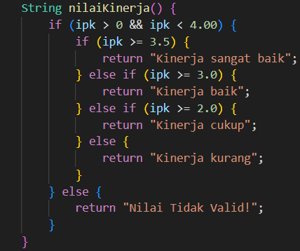
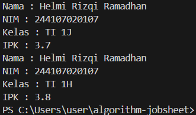
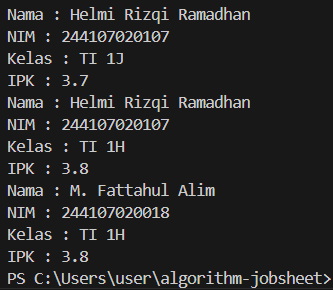
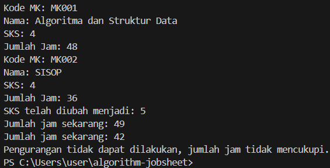
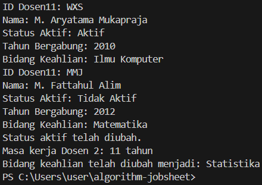

|  | Algorithm and Data Structure |
| ------------- |-------------|
| NIM | 244107020107     |
| Nama | Helmi Rizqi Ramadhan     |
| Kelas | TI-1H     |
| Reposity | [GitHub GH-Rumi](https://github.com/GH-Rumi/algorithm-jobsheet) |

# KONSEP DASAR PEMROGRAMAN

## 2.1 Percobaan 1

Hasil Kode Program:

## Pertanyaan 2.1

1. - Atribut (Properties/Fields),
adalah data atau properti yang dimiliki oleh sebuah objek. Atribut ini menentukan keadaan (state) dari objek tersebut.
   - Metode (Methods/Behaviors),
adalah fungsi atau prosedur yang mendefinisikan perilaku dari sebuah objek. Metode digunakan untuk melakukan operasi atau aksi pada objek.
2. Ada 4, yaitu nama, NIM, kelas, dan IPK
3. Ada 4 juga, yang pertama ada menampilkan informasi, mengubah kelas, mengubah IPK, dan menampilkan nilai kinerja menggunakan IPK
4. 
5. Cara kerja nilaiKinerja() yaitu melakukan pengoreksian pada IPK yang dimasukkan, jika IPK sekian maka yang akan muncul adalah demikian, namun jika IPK melebihi atau kurang dari IPK yang ditentukan, maka akan muncul "Nilai Tidak Valid!"

## 2.2 Percobaan 2

Hasil Kode Program:

## Pertanyaan 2.2

1. Baris Kode untuk Proses Instansiasi

    Mahasiswa mhs1 = new Mahasiswa();

Nama Objek yang Dihasilkan

    mhs1

2. - Cara Mengakses Atribut:

    - Atribut dari suatu objek dapat diakses dengan menggunakan notasi titik (.). Contoh :

            mhs1.nim = "244107020107";
            System.out.println(mhs1.nama);

- Cara Mengakses Method:

    - Method dari suatu objek juga dapat diakses dengan menggunakan notasi titik (.). Contoh :

            mhs1.tampilkanInformasi();

3. Karena dalam kode program tersebut setelah pemanggilan terjadi proses pengubahan kelas dan IPK dengan menggunakan mhs1.ubahKelas(TI 1H) dan mhs1.ubahIPK(3.80)

## Percobaan 2.3

Hasil kode program:

## Pertanyaan 2.3

1.         
        public Mahasiswa(String nim, String nama, String kelas, double ipk) {
        this.nim = nim;
        this.nama = nama;
        this.kelas = kelas;
        this.ipk = ipk;
        }

2. 
        mhs1.nama = "M. Fattahul Alim";
        mhs1.nim = "244107020018";
        mhs1.ipk = 3.80;
        mhs1.kelas = "TI 1H";
   
   maksudnya adalah terjadinya pengubahan data pada data mhs.1 sehingga isinya demikian

3. Jika konstruktor default dihapus, Java tidak akan secara otomatis menyediakan konstruktor tanpa parameter untuk class Mahasiswa. Akibatnya, jika ada kode yang mencoba membuat objek Mahasiswa tanpa memberikan argumen (misalnya dengan `new Mahasiswa()`), maka akan muncul kesalahan saat kompilasi.

4. Tidak, method di dalam class Mahasiswa tidak harus diakses secara berurutan, namun kita dapat memanggil method dalam urutan apa pun sesuai kebutuhan logika program. 

5.  
 Mahasiswa Dzaky = new Mahasiswa("244107020207", "Dzaky Hadyan Eliyanta", "TI-1H", 3.85);
 Dzaky.tampilkanInformasi();

## Latihan Praktikum

1. Hasil Kode Program(Mata Kuliah):

2. Hasil Kode Program(Dosen):

