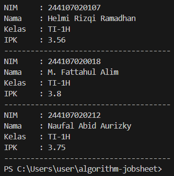
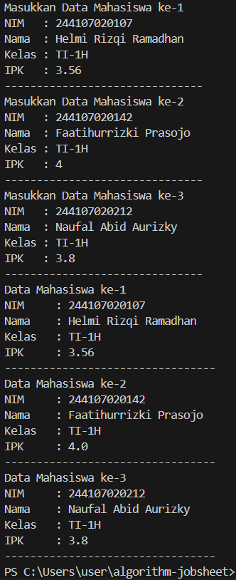
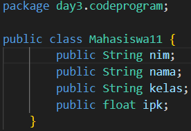
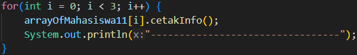
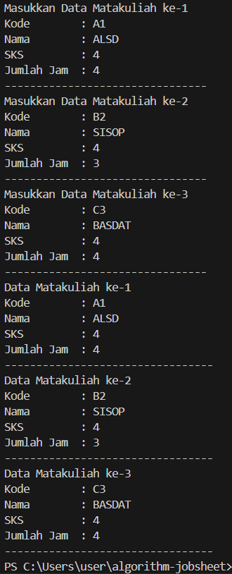
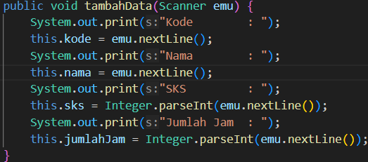
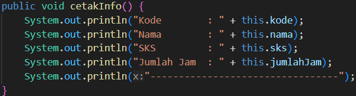
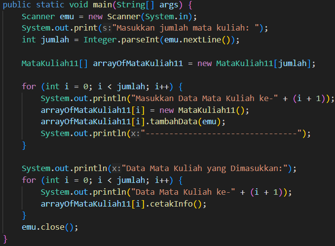
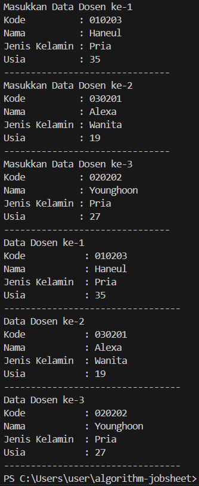
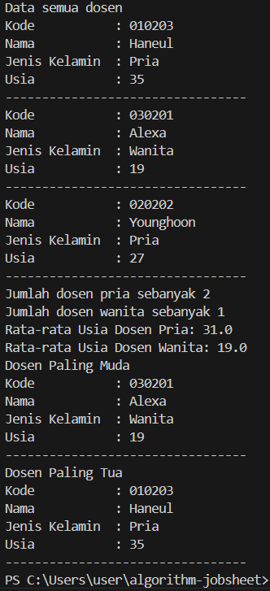

|  | Algorithm and Data Structure |
| ------------- |-------------|
| NIM | 244107020107     |
| Nama | Helmi Rizqi Ramadhan     |
| Kelas | TI-1H     |
| Reposity | [GitHub GH-Rumi](https://github.com/GH-Rumi/algorithm-jobsheet) |

# KONSEP DASAR PEMROGRAMAN

## 2.1 Percobaan 1

Hasil Kode Program:

## Pertanyaan 2.1

1. Sebuah class bisa hanya memiliki atribut atau hanya method. Atribut menyimpan data, sedangkan method mengolah atau menampilkannya.  
2. Kode ini membuat objek dari class, mengisi data, dan menampilkannya ke layar, biasanya untuk contoh penggunaan array of objects.  
3. Jika tidak ada konstruktor buatan, Java menyediakan konstruktor default tanpa parameter.  
4. Program ini membuat array tiga objek Mahasiswa, mengisi data (NIM, nama, kelas, IPK), lalu mencetaknya dengan format rapi.  
5. Class Mahasiswa mendefinisikan data/perilaku mahasiswa, sedangkan Mahasiswa Demo untuk menjalankan dan menguji class tersebut.

## 2.2 Percobaan 2

Hasil Kode Program:

## Pertanyaan 2.2

1. 
kode class Mahasiswa

kode class MahasiswaDemo

2. Jika array `myArrayOfMahasiswa` tidak diinisialisasi terlebih dahulu, akses seperti `myArrayOfMahasiswa[0]` akan menyebabkan error. Ini karena array belum dibuat atau belum memiliki ukuran tertentu. Pastikan selalu menginisialisasi array sebelum menggunakannya untuk menghindari error tersebut.

## 2.3 Percobaan 2.3

Hasil Kode Program:

## Pertanyaan 2.3

1. Ya, class bisa memiliki lebih dari satu constructor (constructor overloading) untuk membuat objek dengan parameter berbeda.

2. 

3. 

4. 

## Tugas 

Hasil Tugas 1:

Hasil Tugas 2:

