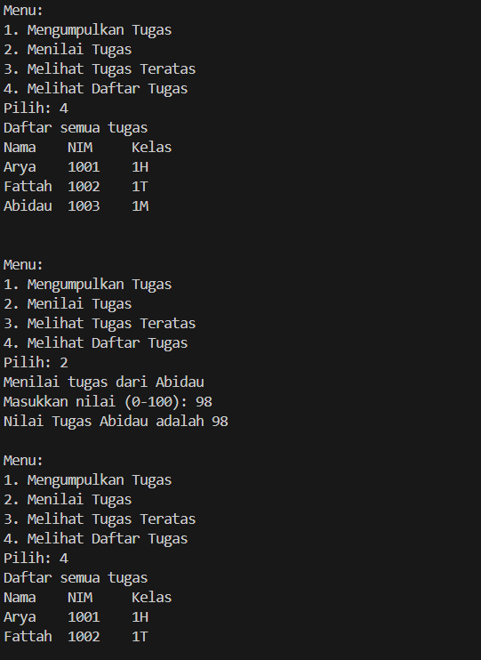
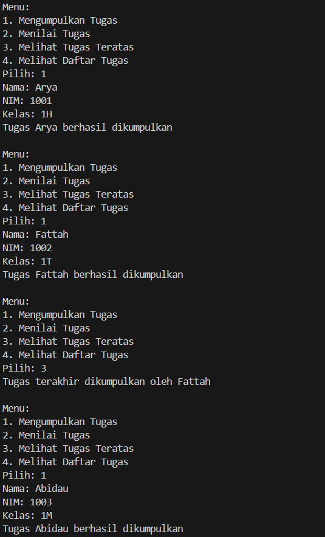
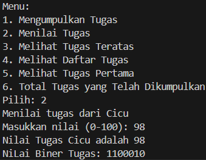
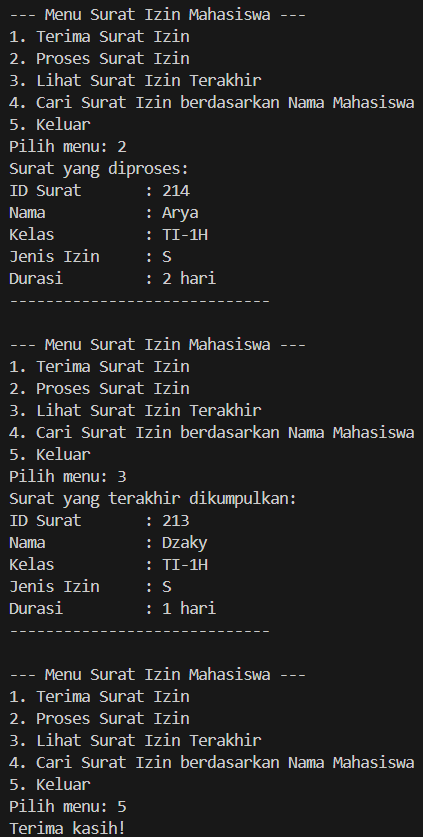
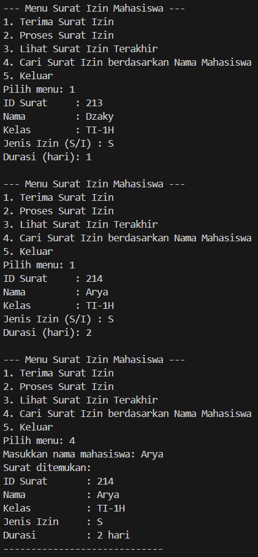

|  | Algorithm and Data Structure |
| ------------- |-------------|
| NIM | 244107020107     |
| Nama | Helmi Rizqi Ramadhan     |
| Kelas | TI-1H     |
| Reposity | [GitHub GH-Rumi](https://github.com/GH-Rumi/algorithm-jobsheet) |

# KONSEP DASAR PEMROGRAMAN

## 2.1 Percobaan 1

Hasil Kode Program:




## Pertanyaan 2.1

1. ```    public void print(){
        for(int i=top;i>=0;i--){
            System.out.println(stack[i].nama+ "\t" +stack[i].nim+ "\t" +stack[i].kelas);
        }
        System.out.println("");
    }
    ```
2. banyak stack yang bisa ditampung sesuai keinginan kita dalam menginput size nya
```
    public StackTugasMahasiswa(int size){
        this.size = size;
        top = -1;
        stack = new Mahasiswa11[size];
    }
```
3. untuk mengetahui apakah stack penuh atau tidak sehingga tidak override, dan jika if else nya dihapus maka data akan override
4. menambahkan method di StackTugasMahasiswa:
```
    public Mahasiswa11 pengumpulanPertama(){
        if(!isEmpty()){
            return stack[0];
        }else{
            System.out.println("Stack kosong! Tidak ada tugas yang dikumpulkan");
            return null;
        }
    }
```
   dan menambahkan perintah di MahasiswaDemo:
```
                case 5:
                    Mahasiswa11 cek = stack.pengumpulanPertama();
                    if (cek != null) {
                        System.out.println("Tugas terakhir dikumpulkan oleh " + cek.nama);
                    }
                    break;
```
5. menambahkan method di StackTugasMahasiswa:
```
    public int totalTugas(){
        int total = 0;
        if (!isEmpty()) {
            total = top+1;
            return total;
        } return 0;
    }
```
   dan menambahkan perintah di MahasiswaDemo:
```
                case 6:
                    int banyak = stack.totalTugas();
                    if (banyak != 0) {
                        System.out.println("Total tugas yang sudah terkumpul ada " + banyak);
                    }else{
                        System.out.println("Belum ada tugas yang dikumpulkan");
                    }
                    break;
```

## 2.2 Percobaan 2

Hasil kode program:



## Pertanyaan 2.2

1. Cara kerja programnya:

- Membagi nilai desimal dengan 2 secara berulang.
- Menyimpan sisa pembagian ke dalam stack.
- Setelah selesai, mengeluarkan semua sisa dari stack untuk mendapatkan urutan biner yang benar.
- Menggabungkan hasil pop dari stack menjadi string biner dan mengembalikannya.

2. Hasilnya akan tetap sama, karena angka berapapun jika kita modulus akan berakhir di angka 0.

## Tugas

Hasil Kode Program:




